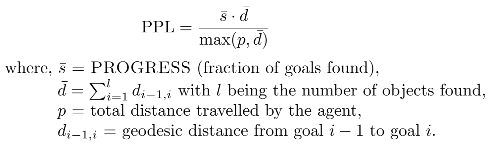

# MultiON Challenge 2021

This repository contains submission guidelines and starter code for the MultiON Challenge 2021. For challenge overview, check [challenge webpage](http://aspis.cmpt.sfu.ca/projects/multion/). To participate, visit EvalAI challenge page.

## Task

In MultiON, an agent is tasked with navigating to a sequence of objects inserted into a realistic 3D environment. The challenge uses [AI Habitat](https://aihabitat.org/) for simulation and uses scenes from Matterport3D dataset. The target objects are randomly sampled from a set of 8 cylinders with identical shapes but different colors. 

In each episode, the agent is initialized at a random starting position and orientation in an unseen environment and provided a 
list of target objects randomly sampled (without replacement) from the set of 8 objects. The agent must navigate to each object in the list, in order, and call a FOUND action to indicate its discovery. The agent has access to an RGB-D camera and a (noiseless) GPS+Compass sensor. GPS+Compass sensor provides the agent's current location and orientation information relative to the start of the episode. The episode terminates when an agent finds all the objects in the current episode or when it calls an incorrect FOUND action or if the agent exhausts its given time budget.


## Dataset
We use [Matterport3D scenes](https://niessner.github.io/Matterport/) for the challenge. We follow the standard train/val/test split as recommended by [Anderson *et al.*](https://arxiv.org/abs/1807.06757) Each episode contains three sequential targets. For the challenge, we focus on the task of 3-ON or 3 object navigation.

## Evaluation
We extend the evaluation protocol of [ObjectNav](https://arxiv.org/abs/2006.13171). We use two metrics to evaluate agent performance:  
**Progress**: Fraction of object goals that are successfully FOUND. This effectively measures if the agent was able to navigate to goals.  
**PPL**: Overall path length weighted by progress. This effectively measures the path efficiency of the agent. Formally, 



## Submission Guidelines  
Participants can enter the contest by our [EvalAI](https://staging.eval.ai/web/challenges/challenge-page/474/overview) page. Participants need to upload docker containers which will be evaluated from our end. 

1. Install [nvidia-docker](https://github.com/NVIDIA/nvidia-docker) by following [these](https://github.com/nvidia/nvidia-docker/wiki/Installation-(version-2.0)) instructions.

2. To get the starter code, clone the repository
```
git clone https://github.com/saimwani/multion-challenge.git
cd multion-challenge
```
3. Build a docker image
```
docker build -t <docker-image-name> .
```
4. Run the docker image
```
sudo docker run -v /path-to-data --runtime=nvidia name:latest
```
5. Implement agent in `evaluate.py`.
6. Submit docker on EvalAI.

## Citing MultiON Challenge 2021
If you use the multiON framework, please consider citing the following paper:
```
@inproceedings{wani2020multion,
    title       =   {Multi-ON: Benchmarking Semantic Map Memory using Multi-Object Navigation},
    author      =   {Saim Wani and Shivansh Patel and Unnat Jain and Angel X. Chang and Manolis Savva},
    booktitle   =   {Neural Information Processing Systems (NeurIPS)},
    year        =   {2020},
    }
```

## Acknowledgements
We thank the [habitat](https://aihabitat.org/) team for building the habitat framework. We also thank [EvalAI](https://eval.ai/) team who helped us host the challenge. This work would not be possible without the [Matterport3D dataset](https://niessner.github.io/Matterport/).

